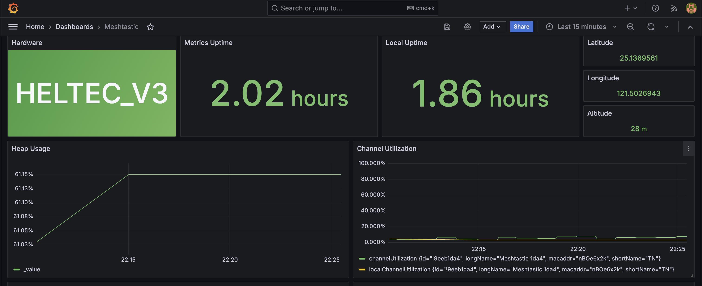
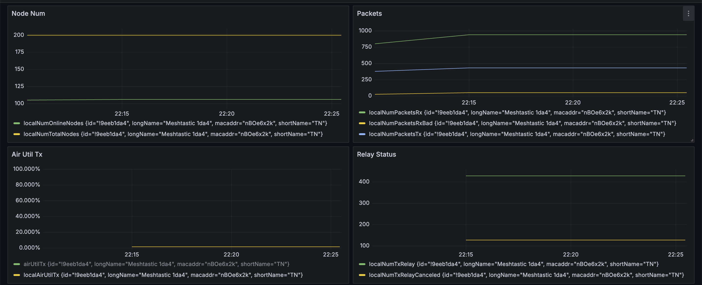
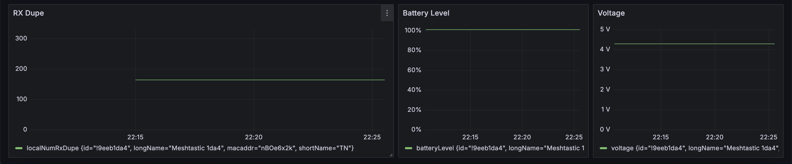

# MeshSentry

A Meshtastic node monitoring solution.

## Overview

MeshSentry provides comprehensive monitoring capabilities for mesh node metrics, analyzing traffic patterns.
## Features




- **Performance Analytics** - Detailed metrics collection and performance insights
- **Dashboard Visualization** - Interactive web-based monitoring interface

## Installation

```bash
git clone https://github.com/TN666/MeshSentry.git
cd MeshSentry
pip install -r requirements.txt
```

## Quick Start
Connect your Meshtastic node through the serial port on your host computer

```bash
# Start the data collector
python main.py

# Start the monitoring service
docker compose up

# Access the dashboard
open http://localhost:3000

# log in with the default credential admin / admin

```

## Configuration
Configure MeshSentry by editing the `.env` file with your specific settings

## Contributing

1. Fork the repository
2. Create a feature branch (`git checkout -b feature/amazing-feature`)
3. Commit your changes (`git commit -m 'Add amazing feature'`)
4. Push to the branch (`git push origin feature/amazing-feature`)
5. Open a Pull Request

## License

MIT License - see [LICENSE](LICENSE) file for details.

